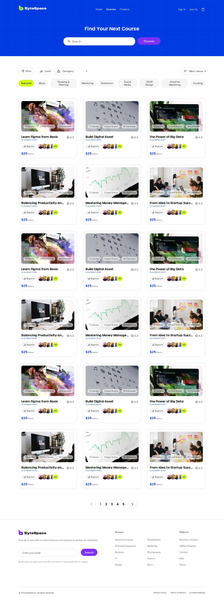
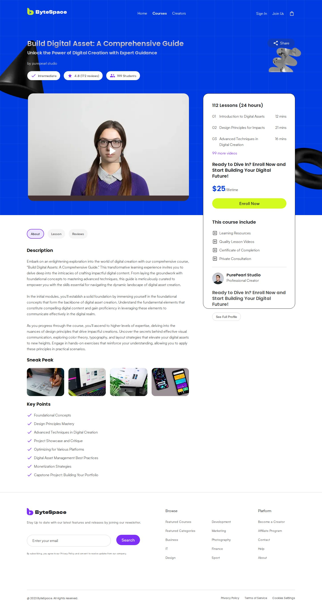
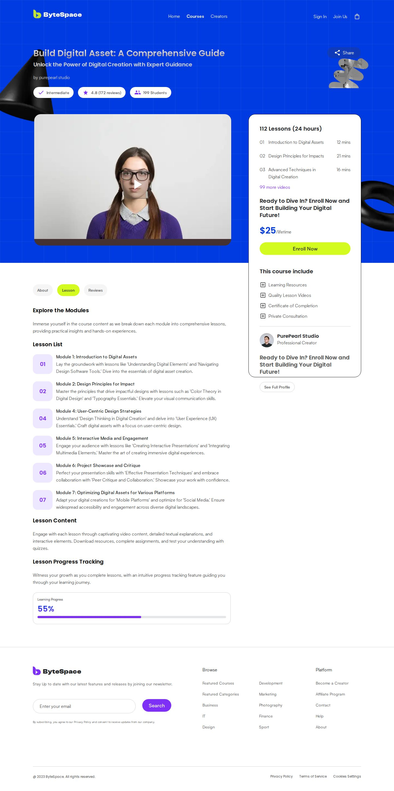
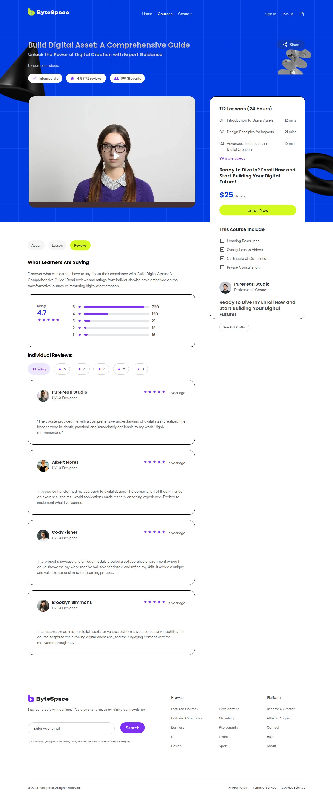
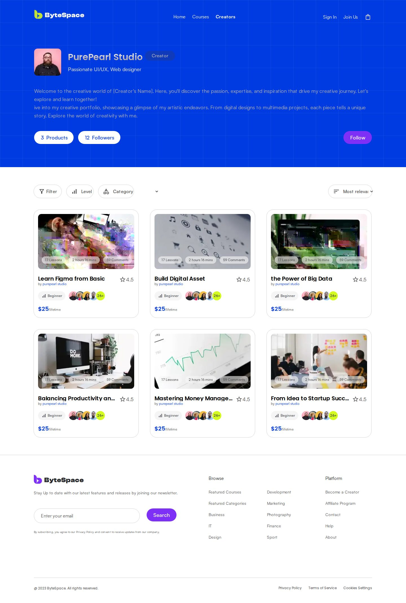
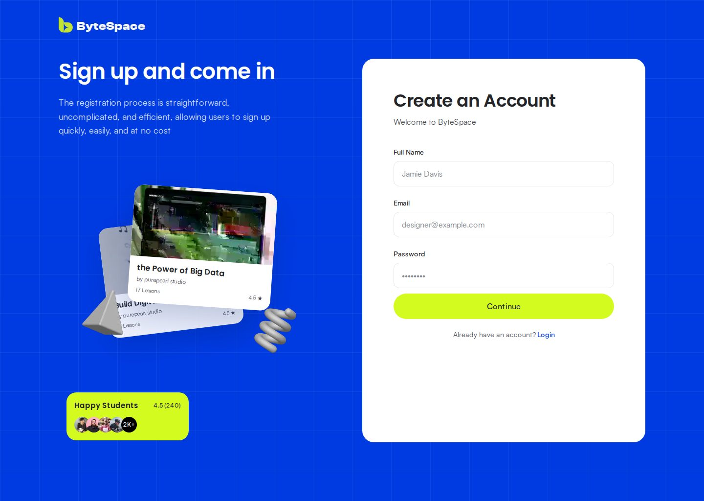
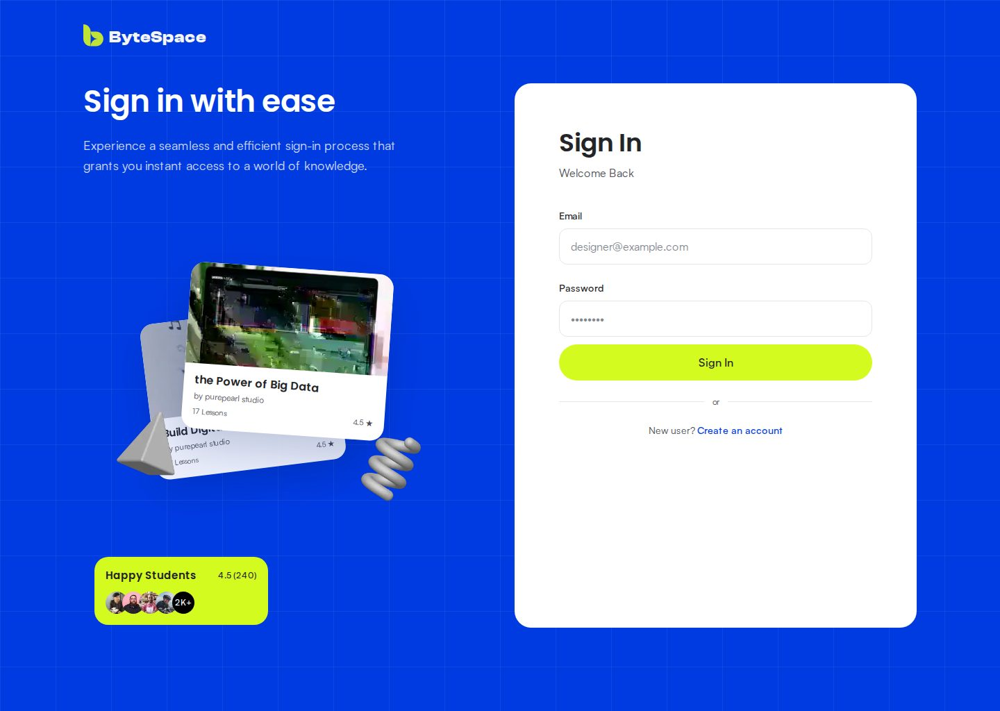
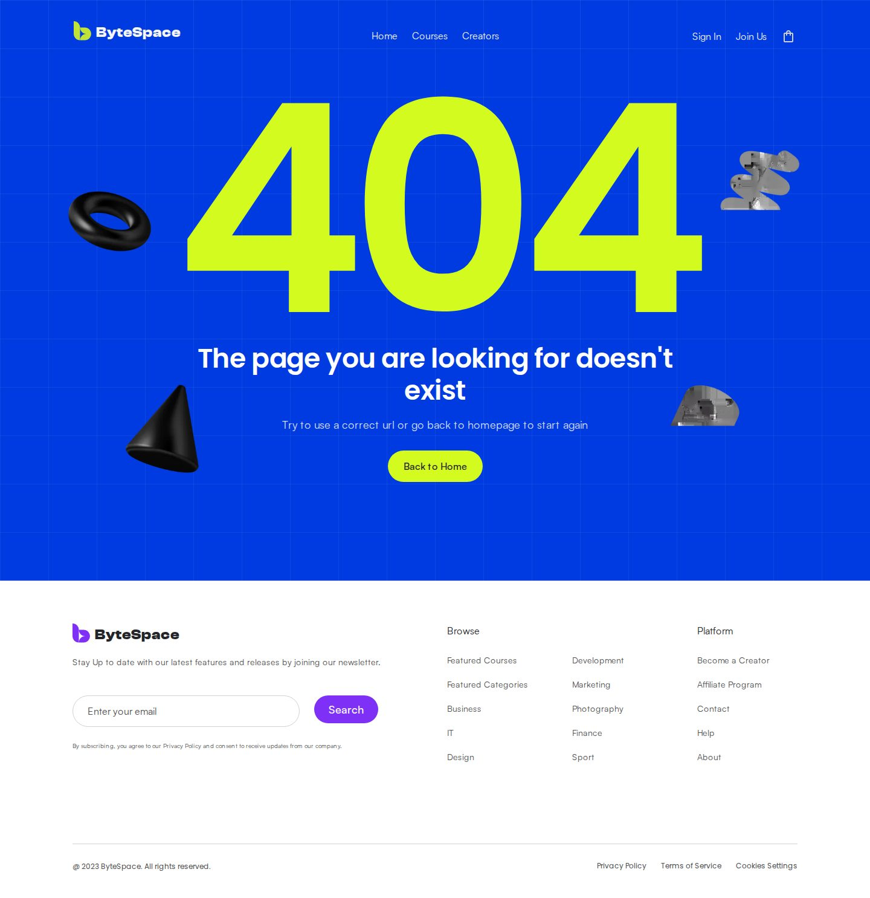
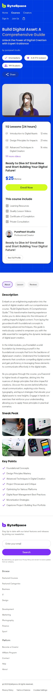
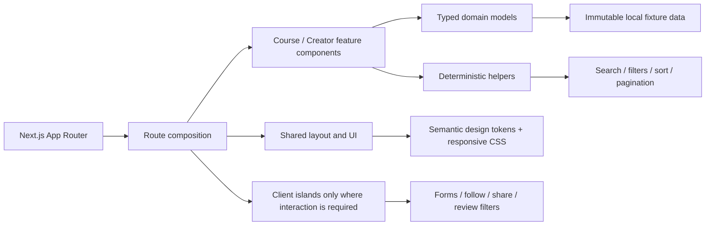

<div align="center">

# ByteSpace

### A production-ready learning marketplace frontend rebuilt from a native Figma source

Pixel-conscious UI • Accessible interactions • Typed domain architecture • Responsive QA • Cross-browser automation • Vercel production deployment

[](https://bytespace-seven-neon.vercel.app)
[](https://github.com/sadmanHT/ByteSpace/actions/workflows/ci.yml)
[](https://nextjs.org/)
[](https://react.dev/)
[](https://www.typescriptlang.org/)
[](https://playwright.dev/)

**[Live Production](https://bytespace-seven-neon.vercel.app)** ·
**[Product Walkthrough](docs/WALKTHROUGH.md)** ·
**[Figma Source](https://www.figma.com/design/kfFdZSGAGn4TFvnKHK4qem/ByteSpace-New-Check-website--Copy-?node-id=0-1&p=f&t=gmF3WiJQh49Q4LGu-0)** ·
**[Engineering Evidence](docs/README.md)**

</div>


> **Production status:** live on Vercel at [bytespace-seven-neon.vercel.app](https://bytespace-seven-neon.vercel.app). The production deployment is verified against release SHA <code>ef5829c1caa076d61c00e6014a84dc2be3821cd3</code>; that implementation is merged into <code>main</code>. Direct-route smoke checks return HTTP 200 for all primary routes, the custom unknown-route experience returns HTTP 404, and Vercel reported no runtime errors during release verification.

---

## About ByteSpace

ByteSpace is a high-fidelity frontend implementation of a learning marketplace experience supplied as a native Figma design. The project translates the visual system into reusable application architecture instead of treating each frame as an isolated mockup.

The implementation emphasizes four things equally: **design fidelity**, **maintainable architecture**, **accessible interaction**, and **release confidence**. Course discovery, creator profiles, authentication forms, course details, lessons, reviews, navigation, responsive layouts, and error states are all implemented as real routes with shared typed data and tested interaction boundaries.

### What makes this repository production-grade

- **Native design-source fidelity** — assets, layout geometry, typography, reusable patterns, and route-level visual checks were derived from the supplied native <code>.fig</code> package.
- **Real application structure** — Next.js App Router, strict TypeScript, shared components, typed domain models, reusable filtering/sorting/pagination helpers, and server-first composition.
- **Accessible by design** — semantic structure, labels, status feedback, keyboard reachability, focus behavior, WCAG-oriented contrast decisions, and automated axe coverage.
- **Responsive and cross-browser** — Chromium viewport matrix from 1440px down to 320px, 200% zoom-equivalent stress, plus Firefox and WebKit smoke coverage.
- **Release automation** — formatting, linting, typechecking, unit/component tests, production builds, Playwright, accessibility checks, and screenshot artifacts run through GitHub Actions.
- **Public production deployment** — a verified Vercel deployment is available for reviewers without requiring local setup.

---

## Production

| Item                                   | Value                                                                          |
| -------------------------------------- | ------------------------------------------------------------------------------ |
| Live site                              | **[bytespace-seven-neon.vercel.app](https://bytespace-seven-neon.vercel.app)** |
| Hosting                                | Vercel                                                                         |
| Framework                              | Next.js 16 App Router                                                          |
| Release source                         | <code>feature/bytespace-new</code>                                             |
| Verified release SHA                   | <code>ef5829c1caa076d61c00e6014a84dc2be3821cd3</code>                          |
| Main integration                       | PR #1 merged into <code>main</code>                                            |
| Runtime environment variables          | None required                                                                  |
| Production smoke                       | Primary routes HTTP 200; unknown route HTTP 404                                |
| Runtime errors at release verification | None reported                                                                  |

---

## Product walkthrough

Every major screen is available as a direct production route. The screenshots below are refreshed from the public deployment by the repository's manual/initial documentation screenshot workflow.

| Experience      | Production route                                                                                                                 | What it demonstrates                                                                                 |
| --------------- | -------------------------------------------------------------------------------------------------------------------------------- | ---------------------------------------------------------------------------------------------------- |
| Home            | [<code>/</code>](https://bytespace-seven-neon.vercel.app/)                                                                       | Hero, course discovery, categories, social proof, learning paths, creator/learner editorial sections |
| Register        | [<code>/register</code>](https://bytespace-seven-neon.vercel.app/register)                                                       | Accessible account-creation form and validation boundary                                             |
| Login           | [<code>/login</code>](https://bytespace-seven-neon.vercel.app/login)                                                             | Accessible sign-in form and local validation                                                         |
| Courses         | [<code>/courses</code>](https://bytespace-seven-neon.vercel.app/courses)                                                         | Search, filtering, sorting, pagination, reusable course cards                                        |
| Course overview | [<code>/courses/build-digital-asset</code>](https://bytespace-seven-neon.vercel.app/courses/build-digital-asset)                 | Course media, metadata, creator, enrollment boundary, overview content                               |
| Lessons         | [<code>/courses/build-digital-asset/lessons</code>](https://bytespace-seven-neon.vercel.app/courses/build-digital-asset/lessons) | Route-backed lesson/module navigation                                                                |
| Reviews         | [<code>/courses/build-digital-asset/reviews</code>](https://bytespace-seven-neon.vercel.app/courses/build-digital-asset/reviews) | Review summary, filtering, reviewer content                                                          |
| Creator         | [<code>/creators/purepearl-studio</code>](https://bytespace-seven-neon.vercel.app/creators/purepearl-studio)                     | Creator identity, local follow state, published-course catalogue                                     |
| Not found       | [example unknown route](https://bytespace-seven-neon.vercel.app/this-route-does-not-exist)                                       | Custom 404 experience with real HTTP 404 semantics                                                   |

### Home

The landing page introduces the marketplace, supports direct course search, surfaces featured learning content, and progressively explains both learner and creator value.


<details>
<summary><strong>Course discovery / catalogue</strong></summary>

The catalogue is built from six canonical course records and reusable card primitives. Search, category, level, sort, and pagination behavior are deterministic local interactions rather than decorative controls.



</details>

<details>
<summary><strong>Course overview</strong></summary>

The course overview combines media, learning metadata, creator identity, enrollment boundary, curriculum context, and shared course navigation.



</details>

<details>
<summary><strong>Lessons</strong></summary>

Lessons are route-backed so browser history, direct links, and refresh behavior remain correct.



</details>

<details>
<summary><strong>Reviews</strong></summary>

The review experience preserves the visual language of the course ecosystem while adding accessible filter/state behavior.



</details>

<details>
<summary><strong>Creator profile</strong></summary>

Creator profiles combine identity, audience context, local follow interaction, and reusable course catalogue presentation.



</details>

<details>
<summary><strong>Authentication screens</strong></summary>

Authentication is intentionally frontend-only because no backend contract was supplied. Forms provide accessible validation and interaction without fabricating sessions, tokens, or successful authentication.

| Register                                             | Sign in                                        |
| ---------------------------------------------------- | ---------------------------------------------- |
|  |  |

</details>

<details>
<summary><strong>Custom 404</strong></summary>

Unknown routes use a branded not-found experience while preserving HTTP 404 behavior.



</details>

### Responsive behavior

Responsive QA covers desktop through narrow mobile layouts, including a 200% zoom-equivalent viewport stress case. Navigation, grids, cards, long text, course media, and decorative elements are constrained to avoid horizontal overflow.



For a screen-by-screen narrative, see **[docs/WALKTHROUGH.md](docs/WALKTHROUGH.md)**.

---

## Architecture



The application keeps page composition, presentation, domain data, and interaction utilities deliberately separate so a future API can replace fixture data without a presentation rewrite.

### Repository structure

```text
.
├── .github/
│   ├── ISSUE_TEMPLATE/
│   ├── workflows/
│   │   ├── ci.yml
│   │   └── docs-screenshots.yml
│   ├── CODEOWNERS
│   └── PULL_REQUEST_TEMPLATE.md
├── docs/
│   ├── screenshots/
│   ├── WALKTHROUGH.md
│   └── ...design and phase audit evidence
├── public/
│   └── assets/
├── src/
│   ├── app/
│   ├── components/
│   │   ├── course/
│   │   ├── course-detail/
│   │   ├── creator/
│   │   ├── discovery/
│   │   ├── layout/
│   │   └── ui/
│   ├── data/
│   ├── lib/
│   ├── styles/
│   └── types/
└── tests/
    └── e2e/
```

---

## Technology stack

| Layer                    | Technology                           |
| ------------------------ | ------------------------------------ |
| Application              | Next.js 16.3.6, React 19.3           |
| Language                 | TypeScript 6 in strict mode          |
| Styling                  | Tailwind CSS 4 + design-specific CSS |
| Package manager          | pnpm 12.7                            |
| Unit/component testing   | Vitest 5 + React Testing Library     |
| E2E/browser testing      | Playwright 1.63                      |
| Accessibility automation | axe-core through Playwright          |
| Formatting/linting       | Prettier 3 + ESLint 9                |
| CI                       | GitHub Actions                       |
| Deployment               | Vercel                               |

---

## Getting started

### Prerequisites

- Node.js <code>>=22.14.0 <23</code>
- pnpm <code>>=12.7.0 <13</code>

### Install

```bash
pnpm install --frozen-lockfile
```

### Run locally

```bash
pnpm dev
```

Open [http://localhost:3000](http://localhost:3000).

No runtime environment variables are required for the current frontend implementation.

---

## Available commands

| Command                        | Purpose                                                                |
| ------------------------------ | ---------------------------------------------------------------------- |
| <code>pnpm dev</code>          | Start the Next.js development server                                   |
| <code>pnpm build</code>        | Create a production build                                              |
| <code>pnpm start</code>        | Serve the production build                                             |
| <code>pnpm format:check</code> | Check Prettier formatting                                              |
| <code>pnpm lint</code>         | Run ESLint with zero warnings allowed                                  |
| <code>pnpm typecheck</code>    | Run TypeScript without emitting files                                  |
| <code>pnpm test</code>         | Run Vitest unit/component tests                                        |
| <code>pnpm test:e2e</code>     | Run Playwright E2E, accessibility, responsive, and cross-browser tests |
| <code>pnpm test:e2e:ui</code>  | Open Playwright UI mode                                                |

To exercise the browser suite against an existing deployment rather than a local server:

```bash
PLAYWRIGHT_TEST_BASE_URL=https://bytespace-seven-neon.vercel.app pnpm test:e2e
```

---

## Quality engineering

The release gate is intentionally broader than a happy-path browser check.

| Area                       | Release coverage                                      |
| -------------------------- | ----------------------------------------------------- |
| Unit/component             | 23 test files, 50 tests                               |
| Playwright                 | 34 tests                                              |
| Chromium responsive matrix | 1440 / 1280 / 1024 / 768 / 390 / 320                  |
| Zoom stress                | 720 CSS-pixel equivalent for 200% zoom                |
| Cross-browser              | Chromium, Firefox, WebKit                             |
| Accessibility              | axe A/AA-oriented scans + keyboard/focus checks       |
| Runtime safety             | console/network failure collection                    |
| Navigation                 | direct routes, refreshes, links, browser history      |
| Layout                     | horizontal-overflow checks and narrow viewport stress |
| Production build           | required before browser gate                          |

The final feature-branch quality gate and pull-request gate both completed successfully before the implementation was merged into <code>main</code>.

---

## Accessibility

Accessibility is treated as part of correctness rather than a post-release enhancement.

The implementation includes semantic landmarks, persistent form labels, accessible validation/errors, keyboard reachability, focus behavior, <code>aria-current</code>/<code>aria-pressed</code> state, progress/rating semantics, pagination state, meaningful image alternatives, decorative-image handling, and practical WCAG 2.2 AA-oriented contrast checks.

Where the supplied Figma source contained a genuine contrast issue, the implementation preserves the visual intent while making the smallest foreground adjustment necessary for practical AA compliance.

---

## Design fidelity

The visual source of truth is the supplied ByteSpace Figma design:

**[ByteSpace New Check website — Figma](https://www.figma.com/design/kfFdZSGAGn4TFvnKHK4qem/ByteSpace-New-Check-website--Copy-?node-id=0-1&p=f&t=gmF3WiJQh49Q4LGu-0)**

Implementation and visual verification were based on the native local package <code>ByteSpace New Check website (Copy).fig</code>.

Native package SHA-256:

<code>a5c21e6873e4a024db448e30ad30703edc797a49bf4e1da4eaa2cc2dc8a97089</code>

Real raster assets were extracted/localized from the native package and served from the repository as optimized assets. Temporary Figma CDN URLs are not used at runtime.

---

## Intentional frontend boundaries

No backend contract was supplied, so the project avoids fake production behavior:

- **Authentication** validates locally but does not create sessions, JWTs, or persist credentials.
- **Enrollment/payment** exposes the UI boundary without collecting payment data or simulating checkout success.
- **Follow** is local UI state and makes no persistence claim.
- **Search/filter/sort/pagination** operate deterministically over the supplied fixture data.
- **Learning progress** is display data where the design supplies it.
- **Newsletter** is frontend-only.
- **Media preview** provides the designed affordance but does not claim playback without a real video source.
- **Share** uses the Web Share API when available with clipboard fallback.

These boundaries are documented so the frontend remains honest and straightforward to connect to real services later.

---

## CI, deployment, and visual documentation

The **Quality Gate** workflow runs on pushes to <code>main</code> and the implementation branch, plus pull requests targeting <code>main</code>. It performs formatting, linting, typechecking, unit/component tests, production build validation, and the complete Playwright browser gate.

The **Production Screenshots** workflow captures the public Vercel site with Playwright and commits documentation screenshots to <code>docs/screenshots/</code>. It is available as a manual workflow so screenshots can be refreshed after a production release.

Release/deployment evidence is recorded in **[docs/phase10-release-audit.md](docs/phase10-release-audit.md)**.

---

## Engineering documentation

The <code>docs/</code> directory records design-source evidence and implementation audits rather than relying on undocumented visual intuition.

Start with **[docs/README.md](docs/README.md)** for the documentation index. Notable records include the design-system audit, asset inventory, shared UI audit, course catalogue audit, Home audit, authentication/404 audit, search/creator audit, course-detail audit, responsive/accessibility/performance audit, and final release audit.

---

## Contributing

Contributions are welcome when they preserve design fidelity, accessibility, typed boundaries, and the existing quality bar.

Read **[CONTRIBUTING.md](CONTRIBUTING.md)** before opening a pull request.

---

## Security

This repository does not require committed secrets or runtime credentials. Please avoid reporting security concerns in a public issue.

See **[SECURITY.md](SECURITY.md)** for the reporting process and current security scope.

---

<div align="center">

Built as a design-to-production frontend engineering project.

**[Open the live ByteSpace experience →](https://bytespace-seven-neon.vercel.app)**

</div>
